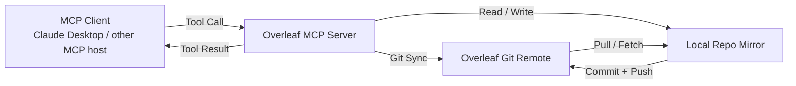
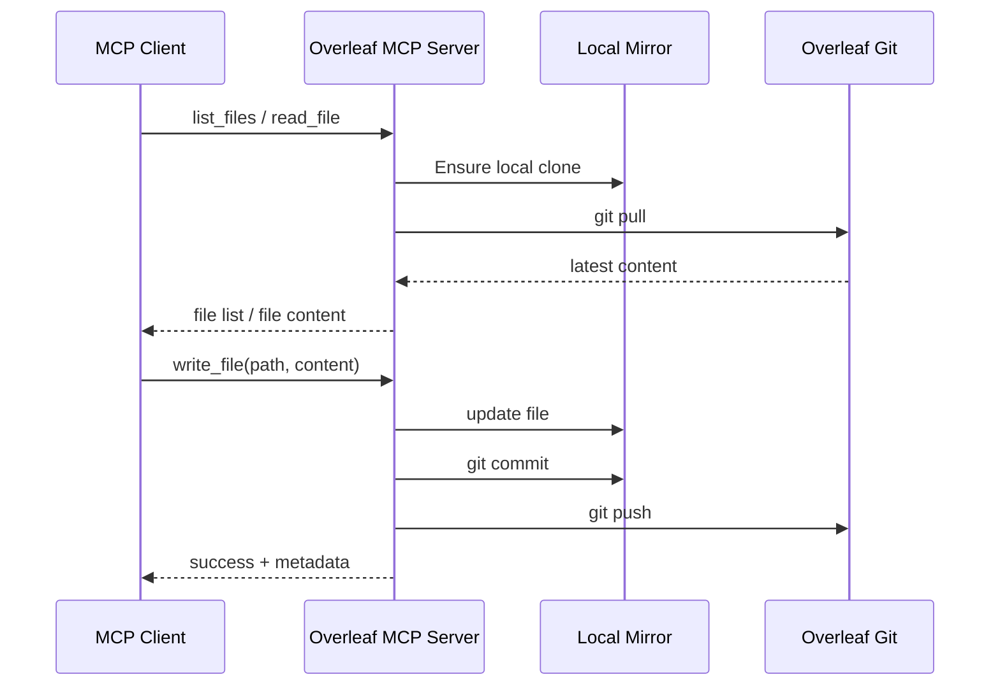

# Overleaf MCP Server

An MCP server focused only on Overleaf projects (via Overleaf Git sync).

## What This Server Does

- Connects MCP-compatible clients to your Overleaf project through Git sync.
- Exposes file-level tools to list, read, write, and sync project content.
- Keeps workflow simple: pull latest files, edit, then push back to Overleaf.

## Architecture



## Tool Workflow



## Quick Start

```bash
git clone https://github.com/younesbensafia/overleaf-mcp-server.git
cd overleaf-mcp-server

uv sync

# Configure environment
cp .env.example .env
# then edit .env with your token/project id

PYTHONPATH=. uv run src/main.py
```

If you are running from an activated virtual environment, you can also use:

```bash
PYTHONPATH=. python src/main.py
```

## Environment

`.env` example:

```env
OVERLEAF_TOKEN=your_git_token
PROJECT_ID=your_project_id
```

Notes:
- `OVERLEAF_TOKEN` is required.
- `project_id` can be passed per tool call, or use default `PROJECT_ID`.
- Overleaf Git access requires a plan that supports Git integration.

## Available Tools

| Tool | Description |
|------|-------------|
| `list_files` | Pull and list files from Overleaf project |
| `read_file` | Read file content |
| `write_file` | Update file, commit, and push to Overleaf |
| `sync_project` | Force a pull/sync from Overleaf |

## Claude Desktop Setup

Add to `~/.config/Claude/claude_desktop_config.json`:

```json
{
  "mcpServers": {
    "overleaf": {
      "command": "uv",
      "args": ["--directory", "/path/to/overleaf-mcp-server", "run", "src/main.py"],
      "env": {
        "PYTHONPATH": ".",
        "OVERLEAF_TOKEN": "your_git_token",
        "PROJECT_ID": "your_project_id"
      }
    }
  }
}
```

## Troubleshooting

- Authentication fails:
  - Confirm `OVERLEAF_TOKEN` is valid and has Git access.
  - Re-check your Overleaf subscription supports Git integration.
- Wrong project content:
  - Set the correct `PROJECT_ID` in `.env`.
  - Or pass `project_id` explicitly in tool calls.
- Sync conflicts:
  - Run `sync_project` before `write_file` if the remote changed.
- Server not starting:
  - Ensure dependencies are installed with `uv sync`.
  - Verify Python 3.13+ is available.

## Requirements

- Python 3.13+
- `uv` package manager

## License

MIT - See [LICENSE](LICENSE)
