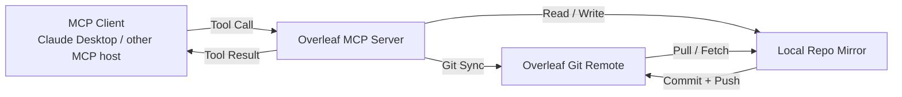
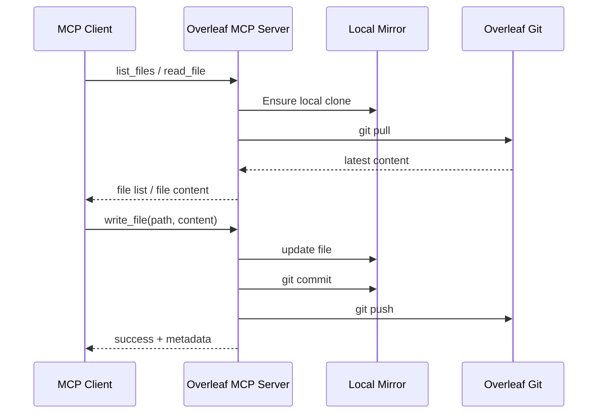

# Overleaf MCP Server

An MCP server focused only on Overleaf projects (via Overleaf Git sync).

## What This Server Does

- Connects MCP-compatible clients to your Overleaf project through Git sync.
- Exposes file-level tools to list, read, write, and sync project content.
- Keeps workflow simple: pull latest files, edit, then push back to Overleaf.

## Architecture


```mermaid
flowchart LR
  C[MCP Client\nClaude Desktop / other MCP host] -->|Tool Call| S[Overleaf MCP Server]
  S -->|Git Sync| O[Overleaf Git Remote]
  S -->|Read / Write| L[Local Repo Mirror]
  L -->|Commit + Push| O
  O -->|Pull / Fetch| L
  S -->|Tool Result| C
```

## Tool Workflow


```mermaid
sequenceDiagram
  participant Client as MCP Client
  participant Server as Overleaf MCP Server
  participant Local as Local Mirror
  participant Overleaf as Overleaf Git

  Client->>Server: list_files / read_file
  Server->>Local: Ensure local clone
  Server->>Overleaf: git pull
  Overleaf-->>Server: latest content
  Server-->>Client: file list / file content

  Client->>Server: write_file(path, content)
  Server->>Local: update file
  Server->>Local: git commit
  Server->>Overleaf: git push
  Server-->>Client: success + metadata
```

## Requirements

- Python 3.13+
- `uv` package manager
- An Overleaf plan with **Git integration** (individual, group, or institution license). Check if your institution provides free access at [Overleaf for Institutions](https://www.overleaf.com/for/institutions-using-overleaf) — use your institutional email. If your institution is not listed, [upgrade your plan](https://www.overleaf.com/user/subscription).

## Git Setup

1. **Enable Git** — open your project on Overleaf → **Menu** → enable **Git** under Integrations.
2. **Copy project ID** — from the browser URL (e.g. `https://www.overleaf.com/project/69a4f7cc4eaf13bd56de5b04` → `69a4f7cc4eaf13bd56de5b04`).
3. **Generate a Git token** — **Account Settings** → **Git integration authentication tokens** → **Generate new token**.
4. **Configure `.env`** — copy `.env.example` to `.env` and fill in:

```env
OVERLEAF_TOKEN=your_git_token
PROJECT_ID=your_project_id
```

> `project_id` can also be passed per tool call if you leave `PROJECT_ID` unset.

## Quick Start

```bash
git clone https://github.com/younesbensafia/overleaf-mcp-server.git
cd overleaf-mcp-server
uv sync
cp .env.example .env   # then edit with your token/project id
uv run python -m src.main
```

The server listens on stdio — connect your MCP client (Claude Desktop, etc.) to it.

## Available Tools

| Tool | Description |
|------|-------------|
| `list_files` | Pull and list files from Overleaf project |
| `read_file` | Read file content |
| `write_file` | Update file, commit, and push to Overleaf |
| `sync_project` | Force a pull/sync from Overleaf |

## Claude Desktop Setup

Add to `~/.config/Claude/claude_desktop_config.json`:

```json
{
  "mcpServers": {
    "overleaf": {
      "command": "uv",
      "args": ["--directory", "/path/to/overleaf-mcp-server", "run", "python", "-m", "src.main"],
      "env": {
        "OVERLEAF_TOKEN": "your_git_token",
        "PROJECT_ID": "your_project_id"
      }
    }
  }
}
```

## Troubleshooting

- **403 Forbidden on git operations:**
  - Your plan doesn't include Git integration — follow the [Git Setup](#git-setup) section.
  - Or the Git token is wrong — regenerate it at **Account Settings** → **Git integration authentication tokens**.
- **Wrong project content:**
  - Set the correct `PROJECT_ID` in `.env`.
  - Or pass `project_id` explicitly in tool calls.
- **Sync conflicts:**
  - Run `sync_project` before `write_file` if the remote changed.
- **Server not starting:**
  - Ensure dependencies are installed with `uv sync`.
  - Verify Python 3.13+ is available.

## License

MIT - See [LICENSE](LICENSE)
